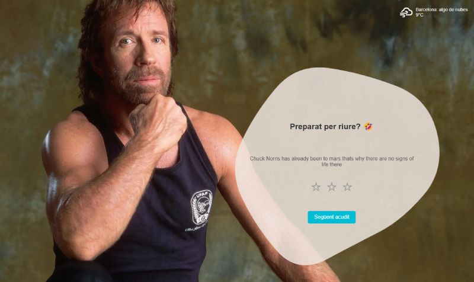

# S4.-API

<p align="center">
  
</p>

## 📄 Descripción

Este repositorio implementa una aplicación web interactiva desarrollada con **TypeScript** que realiza llamadas a diferentes APIs externas. La aplicación obtiene datos de **chistes** (mezclando chistes de Chuck Norris y genéricos) y muestra información meteorológica en tiempo real para la ciudad de **Barcelona**.

## ✨ Características

- **Chistes Aleatorios**: Obtención de chistes de 2 fuentes de APIs (*https://api.chucknorris.io* y *https://icanhazdadjoke.com/*).
- **Clima Actual**: Conexión a una API meteorológica (*https://openweathermap.org/*) para mostrar el clima actual en Barcelona (estado del tiempo y temperatura).
- **Interfaz Dinámica**: Visualización de datos en la interfaz de usuario de forma interactiva y clara.
- **Uso de TypeScript**: Implementación estricta con **TypeScript** para un código más robusto y mantenible.

## 💻 Tecnologías Utilizadas

- **TypeScript**
- **HTML5 y CSS3**
- **APIs REST**
- **JavaScript (compilado desde TypeScript)**

## 🌐 APIs Utilizadas

1. **API de Chuck Norris**: *https://api.chucknorris.io*
2. **API de chistes icanhazdadjoke**: *https://icanhazdadjoke.com/*
3. **API Meteorológica**: *https://openweathermap.org/*

## 📋 Requisitos

- **Node.js** y **npm** instalados en tu sistema. Descárgalos desde [nodejs.org](https://nodejs.org/).
- Navegador web compatible con **HTML5** y **JavaScript**.
- Editor de código, como **Visual Studio Code** (opcional).

## 🛠️ Instalación

**✔️ Paso 1:** Clona este repositorio en tu máquina local:
```bash
git clone https://github.com/basantades/S4.-API.git
```


**✔️ Paso 2:** Ingresa al directorio del proyecto:
```bash
cd S4.-API
```

**✔️ Paso 3:** Instala las dependencias necesarias:
```bash
npm install
```

## ▶️ Ejecución

- Abre el archivo **index.html** en tu navegador para visualizar la aplicación.
- También puedes utilizar un servidor local, como la extensión **Live Server** en **Visual Studio Code**, para una mejor experiencia de desarrollo.

O visita la versión **en vivo** de la aplicación aquí:  
👉 **[Demo del Proyecto](https://basantades.github.io/S4.-API/)** 👈

## 🤝 Contribuciones

Si deseas colaborar en este proyecto o reportar algún problema, no dudes en:

1. Crear un **issue** para reportar errores o sugerir mejoras.
2. Enviar un **pull request** con tus contribuciones.
